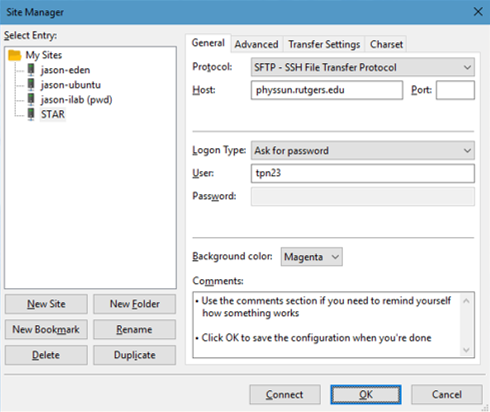
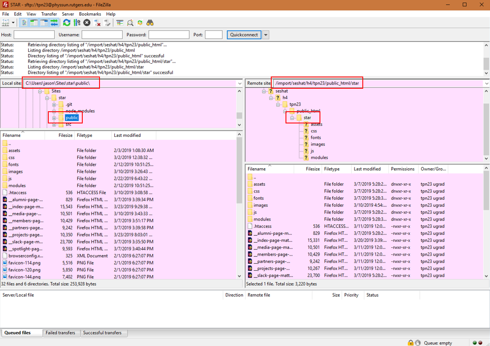
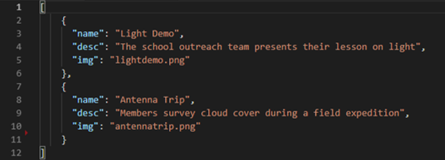

# STAR Official Site <!-- omit in toc -->

### Website of the [Space Technology Association of Rutgers](http://star.physics.rutgers.edu). <!-- omit in toc -->

### *Assembled by Jason Scot.* <!-- omit in toc -->

*README last updated 03/24/2019*

## Table of Contents <!-- omit in toc -->
- [Overview](#overview)
  - [***Basics***](#basics)
  - [***Updating this Guide***](#updating-this-guide)
- [Version Control](#version-control)
  - [***Cloning the Repo***](#cloning-the-repo)
  - [***Pulling Changes***](#pulling-changes)
  - [***Uploading Changes***](#uploading-changes)
  - [***Recap***](#recap)
- [Affecting the Site](#affecting-the-site)
  - [***Connecting via FTP***](#connecting-via-ftp)
  - [***Uploading to the Site***](#uploading-to-the-site)
  - [***Permissions and Overwrites***](#permissions-and-overwrites)
- [Updating Code](#updating-code)
  - [***NPM & Dependencies***](#npm--dependencies)
  - [***Coding***](#coding)
- [Updating Pages](#updating-pages)
  - [***HTML***](#html)
  - [***Naming Convention and URLs***](#naming-convention-and-urls)
  - [***Special Note on the Index Page***](#special-note-on-the-index-page)
  - [***Images***](#images)
- [Modules](#modules)
  - [***General Format***](#general-format)
  - [***JSON***](#json)
  - [***Homepage: Carousel***](#homepage-carousel)
  - [***Members: Eboard Gallery***](#members-eboard-gallery)
  - [***Members: Meeting Details***](#members-meeting-details)
  - [***Partners: Partners Carousel***](#partners-partners-carousel)
  - [***Keep in Mind***](#keep-in-mind)
- [Article Modules](#article-modules)
  - [***Projects: Root Module***](#projects-root-module)
  - [***Projects: Team Modules***](#projects-team-modules)
  - [***Spotlight: Root Module***](#spotlight-root-module)
  - [***Spotlight: Article Modules***](#spotlight-article-modules)
- [Semesterly Update Checklists](#semesterly-update-checklists)
  - [***Members Page***](#members-page)
  - [***Projects Page***](#projects-page)
  - [***Index Page***](#index-page)
- [Final Thoughts](#final-thoughts)

<hr>

## Overview

### ***Basics***

Welcome. This README markdown file is meant as a reference for the website's curator to use when uploading/editing site materials.

The first half of this guide is dedicated to quickly getting your coding environment up and running. The second half explains how to actually affect changes within the website. As you are first introduced to these technologies, someone with the appropriate level of knowledge will probably help you through it, and you can just use it as needed (consulting it more like a reference than a guide).

Side note: if you have web development experience and feel like you can jump right in, go for it. I built this site/framework with ease of updating in mind (well, I tried to anyway) for people with no coding knowledge. But I won't be offended in the slightest if you go ahead and change stuff. Even if you trash the entire site and replace it with something all your own, more power to you! If it's what's easiest for you and best for STAR during your tenure, it's what you should do. With that said, let's continue under the assumption that you will be using this framework...

Ideally, you will barely need to read this guide. In fact, this site was made with the assumption that only the different [*modules*](#modules) would need to be updated, and this can be done without coding anything whatsoever. However, the reason this guide is so thorough is so future STAR website curators may explore and implement new features if they know what they are doing (or are willing to learn). Or, if something ever were to go wrong with the site, so they could figure out how to fix it.

If you have never done any web development or coding stuff before, the first thing you will need is a web-optimized text editor. I highly recommend [installing Visual Studio Code](https://code.visualstudio.com/Download) for this purpose if you do not have another preference. It has a built-in console, nice structure/layout, great plugin choices, and a solid feel. If you use VS Code, you will definitely want to use some kind of [live preview plugin](https://marketplace.visualstudio.com/items?itemName=ritwickdey.LiveServer) to visualize site changes.

### ***Updating this Guide***

If anything ever gets outdated (e.g. the URL for the site, the URL for the repo, the URL for the hosting server, etc.), then please update this guide and push those changes! If you are unfamiliar with Markdown, take a look at an [online guide](https://github.com/adam-p/markdown-here/wiki/Markdown-Cheatsheet) or use this handy [VS Code plugin](https://marketplace.visualstudio.com/items?itemName=yzhang.markdown-all-in-one).

<hr>

## Version Control

Version control for this project is managed with git, and stored remotely using BitBucket at the repository ("repo") [https://bitbucket.org/jasonscot/star/src/](https://bitbucket.org/jasonscot/star/src/)

To begin accessing the repo, you must have a BitBucket account that has been made a collaborator on this project (if you need this access but do not have it yet, contact a member with administrative access to the git repo). Then, you will need to [install Git](https://git-scm.com/book/en/v2/Getting-Started-Installing-Git), the version control software. This is what lets you make changes locally that agree with the version stored by BitBucket.

The following are the simplified steps you must take to get up and running with Git/Bitbucket *after first installing Git*. If you need more help using or understanding Git or BitBucket, please consult a [tutorial](https://www.atlassian.com/git/tutorials/setting-up-a-repository/git-clone) or search the Internet for a solution to the problem(s) you are facing. You may also contact whoever formerly administered the site.

### ***Cloning the Repo***

Downloading the repo to your local machine for the first time is called **cloning** the repo. After installing Git and gaining access with your BitBucket account, choose the directory on your local machine where you would like to hold all the site's files. It is recommended to make a new directory for your web sites if you do not already have one (e.g. *C:/users/jason/Sites/*). Go to this directory, then open a terminal (on Windows, a Git terminal—not *cmd*) and type the following command.

```
git clone https://bitbucket.org/jasonscot/star/src/
```

Enter your BitBucket account information when prompted. Now you have the most recent copy of the repo on your local machine. At some point, someone else with access may upload newer changes to BitBucket, in which case you will need to pull their changes if you want to keep up with their version.

### ***Pulling Changes***

In general, before making any changes, make sure you **pull** the latest version to your local machine, to avoid merge conflicts. To pull, simply run the following command in the *star* directory that was created by cloning the repo (*not the directory you ran the clone command in*).

```
git pull
```

### ***Uploading Changes***


The following command "adds" everything in this repository (directory's contents) to a list of objects that will be used later. This keeps track of all changes you've made within this directory (adding files, deleting files, editing files, etc.) The asterisk is a common symbol used to mean "all" or "everything" in software jargon.

```
git add *
```

Next, this command "commits" the list of objects that you just selected to your local repo, solidifying them as the most recent version. You should write a descriptive update message in your command (do include the quoatation marks) instead of just writing *message here*.

```
git commit -m "message here"
```

Finally, this command will **push** your local repo to BitBucket, adding your changes to the official version online.

```
git push
```

NOTE: you could add things one by one by simply naming them outright instead (e.g. *git add index.htm* then *git add spotlight.htm*, etc.); each time you run "add" the list of items to commit to the remote repo for storage is expanded, and that list is only flushed when you commit or manually flush it.

NOTE: also, if you know how (or would like to learn) to use "fancy" Git stuff, like the built-in commit pane in VS Code, go ahead and do it! In fact, if you want to try anything that seems cool, including changing stuff in the site's code, go for it. If it works, then upload it to the server and show the world. Never let this guide become a limitation for you.

### ***Recap***

This is an extremely basic overview of Git, but it is sufficient to get you up and running. You learned the commands that you will use the most: **add**ing, **commit**ting, **push**ing, **pull**ing, and **clone**-ing. Again, for more information, please consult online tutorials.

One common difficulty you may have, especially multiple people have access to the repo, is the [merge conflict](https://www.youtube.com/watch?v=cfkWqGwByC4). This happens when two people try to **push** versions that directly conflict with one another. To avoid these, coordinate with everyone working on the site and *always pull before you push*. If you do encounter them, you will need to troubleshoot online.

<hr>

## Affecting the Site

The instructions above for version control will only affect the BitBucket repo for the site. This is where the site's files are stored and maintained, but not where they are hosted online. To affect the site itself, you will need to use an SSH or FTP client to interfact with the site hosting server. 

**NOTE: you will need the password to the site server to proceed; please have STAR's president put you in contact with the appropriate officer if you do not know how to obtain this password.**

### ***Connecting via FTP***

Friendly to beginners, FTP is a solid (albeit old and simple) tool for interfacing with file hosts. FileZilla is a good, basic FTB client, which you can [install from here](https://portableapps.com/apps/internet/filezilla_portable). If this link doesn't work, do an Internet search for "FileZilla Portable" and download it from the PortableApps site.

If you are using FileZilla, open the application and go to File>Site Manager. A screen like the one pictured below should appear.



Click **New Site** and name it **STAR**. Then use the following settings (as seen in the image):
1.  Protocol: SFTP
2.  Host: **physsun.rutgers.edu** (this is the server that hosts our site)
3.  Port: (leave empty; default SSH port will be used)
4.  Logon Type: Ask for password
5.  User: **tpn23**
6.  Background color can be anything you want

Now you can save this site configuration (click OK).

You can now connect to this server any time by navigating back to File>Site Manager, choosing STAR, and clicking **Connect**. Alternatively, you can click the servers dropdown menu (under the File tab) and choose STAR. Either way, you will need to enter the server password to connect each time.

Uploading, downloading, and changing things on the server is very similar to changing things on your machine's own file system interface, so I do not explain it in detail in this guide.

If you need help with navigation, please refer to [this page](https://wiki.filezilla-project.org/Using#Navigating_on_the_server).

### ***Uploading to the Site***

This part is very important. When uploading stuff to the site server, upload all the contents (including subsirectories) of the **public/** directory from your repo, and *only* the contents of the public/ directory, to the server. All other files and directories from the repo must *not* be uploaded. This is because most of the stuff in the repo comes together on the development side (your side!) to produce what ends up in the public/ folder.

For example, it will look something like this...
- *source (inside local repo on your machine)*: **C:/Users/jason/Sites/star/public/**
  - Note that the first part won't be the same as on your computer, but it will always end in **/star/public/**
- *destination (on server)*: **/import/seshat/h4/tpn23/public_html/star**
  - Note that the first part might not be the same, but it will always end in **/tpn23/public_html_star/star**

This pretty simple, but it is also so important that I have included an example image below of what this looks like in FileZilla.



### ***Permissions and Overwrites***

Three quick (but very important) notes about uploading things, especially new files.

1. The permission level of ***all*** files on the site server should be set to 755. If you CTRL+A on the server side, then right click and select "File Permissions..." you can use the numeric value 755 and *do recurse into subdirectories*. This will make it so anyone can read or execute files on the server (good for viewing and running JavaScript) but that only you can write things. This is actually extremely important, because—albeit unlikely—if you were to set permissions that let anyone write files, the site would become much more vulnerable to people writing in malware/changing your content.
2. Often, while changing things for the site, I will forget exactly what I worked on, even after pushing to BitBucket. So, when uploading files to the site server, I just do a CTRL+A to select everything in my *public/* folder, then upload them all to the server's *star/* folder. (Note that if you only work with Modules, you can do this on the *modules/* folder instead.) It will then tell me that many of these files already exist on the server, and ask me what to do. At this point, I select "Overwrite if source is newer" and check the boxes "Always perform this action" and "Apply to current queue only." This makes it so everything I have in my repo gets saved as the newest version of the site.
3. When you look at the site on your browser to check it after uploading new content, since you only just uploaded your changes a moment ago, your browser is probably showing you a cached version and not the latest update. Just hard refresh (CTRL+F5) any pages that don't seem to have updated after you save updates to the server to see if that's the issue.

<hr>

## Updating Code

Editing the project's HTML and adding new documents/directories can be done easily (explained in the next section, [Updating Pages](#updating-pages)). However, editing this project's existing JavaScript or SASS/SCSS will necessitate installing the appropriate npm dependencies. If you only plan on editing HTML and modules in the *public* directory (and not *node_modules* or *src*), you can skip this part.

### ***NPM & Dependencies***

JavaScript and CSS in the *star/public/* directory is compiled down from corresponding JavaScript and SASS/SCSS in the *star/src* folder. This means that you must use npm to affect preexisting JavaScript and CSS. You *could* technically create new JavaScript and CSS files if you don't want to figure out how to affect the preexisting ones this way, but I strongly urge against doing that. NPM also controls the versions of Bootstrap, fontawesome, and other integrations used by this site. It's a good idea to [learn how to use it](https://www.sitepoint.com/beginners-guide-node-package-manager/)!

To use NPM, first, you will need to [install node + npm](https://www.npmjs.com/get-npm) on your machine.

Then in the site's main directory (*star/*), running the following command will install all the appropriate dependencies in *node_modules* (which may take a little while to finish).

```
npm install
```
The framework is set up such that, next, the only thing to do to initialize the JavaScript and SCSS watcher any time you edit the **src** files is run the command
```
npm run watch
```
in the project's main directory. This will compile code from **src/sass/** and **/src/scripts** into **public/css/** and **public/js/**, respectively, whenever you save the *src/* files. You *only* need to **npm run watch** when affecting *src/* files, not all the time.

NOTE: *Please* follow these above steps to change this project's JavaScript code, and especially CSS/SCSS. The CSS file *public/main.css* is compiled down from SCSS, so changing *main.css* directly (i.e. not by compiling down SCSS) will likely break something or itself be broken later on.

### ***Coding***

A certain familiarity with CSS and JavaScript is assumed if you are trying to so deeply affect these things on the site. A strong understanding of SASS/SCSS is also assumed, but [graduating from CSS to SASS](https://css-tricks.com/sass-style-guide/) is not too difficult. If this guide contained a lot of things you were unfamiliar with so far, and you want to change things like the styling and functionality of the site, please look up guides and get help from other STAR people before going down the coding rabbit-hole. If all you want to do is change HTML, images and page content, continue on.

<hr>

## Updating Pages

Phew! You're past all the setup stuff. Good. If you finished doing all that, you probably won't need to revisit it again. And I promise you won't be told to install anything else.

Anyway, this next half of the guide is not as much "how to use this general technology" as it is "how STAR's site is structured, and how you can easily change things in it without coding anything."

### ***HTML***
As stated above, you can change the HTML of the site however you need. Just test it each time before uploading it, to make sure you didn't accidentally invalidate a hook into some code or something. HTML is basically the content of the site and how it is structured and presented.

If you are new to markup, please [read the basics](https://www.w3schools.com/html/html_basic.asp) (and maybe even try some samples) before continuing. You will probably have no reason to change the HTML of this site, but if you need to, try your best to only edit text (not structure or anything within tags) unless you know what you are doing.

### ***Naming Convention and URLs***

The pages in this site have the naming convention **__\<page_title\>-page-matter.htm** (e.g. *__index-page-matter.htm*). The two leading underscores make them appear at the top of your file hierarchy, and the *-page-matter.htm* part is there to make it less likely any random site visitor will guess the full address. But you'll notice that all the URLs between pages reference each other simply as *partners*, *projects*, *members*, etc. This is because our server uses a RewriteRule (you can see this in the .htaccess file in *public/*) which rewrites (in this case, shortening) the URL when it is hosted on a server.

All this is to say that, to edit a page (the **members** page for example) you will edit the appropriate HTML file (e.g. **__members-page-matter.htm**) and upload it to the server's *star/* directory. If you are testing the site and notice that links don't seem to work, that's the point. The links you write in the HTML only work on servers that can implement the rewrite rules. If you really want to get them to work locally, I suggest figuring out how to run a server locally that can do that. Otherwise, you can just paste the full file name into your local testing setup each time you want to move to a new page.

And if you make a new page, you will have to add a new RewriteRule to the .htaccess file if you want its URL to be changed at all on the server side.

### ***Special Note on the Index Page***

The index page (**index.html**) is where visitors are automatically taken when they go to our site's URL without appending a specific page. In other words, this is our site's homepage. To accomodate the server's rules, like those governing use of the Physics department's PHP scripts, we have to maintain three copies of the index page: **index.html**, **index.html~**, and **__index-page-matter.htm**. When changing the index page's HTML, work within **__index-page-matter.htm**, and when ready to upload your changes to the server, simply copy and paste everything from **__index-page-matter.htm** over everything in both **index.html** and **index.html~**.

### ***Images***

You can see the convention I started in the *public/images/* folder. Images that aren't part of modules go there: images only appearing on one page get their own folder (that page's name), and images appearing in various places (like the navbar of each page) go in the root of *images/*. You only need to use this *images/* folder for non-module-managed photos!

<hr>

## Modules

Finally, the main point of this guide. Modules are json files that I have set up as interfaces for you to affect some of aspects of the site I expect will need to be updated most often. I called them modules because they are meant to be somewhat modular, and especially simple to use. They have no relation to npm's *node_modules*

I have made several modules, about one per page. Each, along with its usage, is listed in its own subsection below. They are all meant to be pretty self-explanatory. The best tip I could give you for using them are to see how they seem to work before you change them, then see what exactly changes when you affect each field. Alright, let's dive in.

### ***General Format***

You will use modules by changing their associated json files. These are all located in the *public/modules/* folder of this repo, in a directory with the name of the page that specific module lives on. This directory contains the json file and any files that it uses to do its thing.

For example, the index page's carousel is a module. It has a bunch of pictures with caption that scroll by automatically on the home page. The directory *public/modules/home/* contains a file called *carousel.json*. This is the module's json interface. The same folder also contains a bunch of images. These are the photos that are displayed by this module. Changing stuff in the json file will change what gets displayed by the module when it loads on a user's computer. E.g., changing an "*img*" field to the name of an image that doesn't exist in the module's folder would make only the description pop up when that image attempts to load.

### ***JSON***

Since the way you interface with a module is via a json file, let's first explore what a json file is. If you are already familiar with json, skip this subsection.

A json file is just a bunch of key-value pairs following a certain structure. A key, simply, is the name of a given field. Each value, in these modules, is the string value of a given key. An array is represented with brackets [ ] and an object is represented with curly braces { }. For example, in the image below, we see the home page's carousel module json is an array with two objects in it. Each object has three fields: *"name"*, *"img"*, and *"desc"*.



If you were trying to change the description displayed alongside the picture "*lightdemo.png*" on the homepage, you would simply change the value corresponding to "*desc*" in the first object in the array. Save the json file afterward, and that's it. Push your changes to git, then upload to the site server, and the change will be saved as the new release version. Play around with this and try stuff out to get comfortable with it!

NOTE: the json format is pretty rigid. Make sure all your keys and values are contained in quotation marks, separated by a colon. Also make sure each item before another ends with a comma. Luckily, VS Code will show you if you have json formatting errors.

The next few subsections describe the modules in use on the site. If you have any questions, talk to the person/people who preceeded you as the website curator.

### ***Homepage: Carousel***

- *purpose*: To greet site visitors with interesting photos that show off and describe some of the stuff we've done
- *path*: **star/public/modules/home/carousel/**
- *json file name*: **carousel.json**
- *non-json contents*: photos used by *carousel.json*
- *remarks*: photos will resize to a 1200:700 width:height ratio, which may be awkward, so you will probably want to prefit/crop these images before-hand; also note that on mobile these images resize to a 1:1 width:height ratio, keeping the center of the image in the center, so try to take pictures that have something interesting in the center with not much action on the sides
- *json format*:
  - 1 array of however many objects (you can add and delete photos without problem, as long as there is at least one photo in the carousel; they show up from first to last, as listed in the json file)
    - each object has 3 fields
      - "name": what to call the photo
      - "desc": a short description of the photo, appearing under the photo on the site
      - "img": the image file this slide refers to

### ***Members: Eboard Gallery***

- *purpose*: To maintain a list of the current STAR officers
- *path*: **star/public/modules/members/eboard/**
- *json file name*: **eboard.json**
- *non-json contents*: **defaultpic.png** (a default picture for members who haven't uploaded a photo of themselves), along with the square photos of eboard members used by *eboard.json*
- *remarks*: photos do not automatically resize, but they are automatically cropped to circles; please only use perfectly square photos with their subject at the center, or it will look really weird
- *json format*:
  - 1 array of however many objects (you can add or delete board members without problem; they show up from first to last, as listed in the json file)
    - each object has 8 fields
      - "position": the position this eboard member holds (e.g. President)
      - "name": the full name of this eboard member (First Last)
      - "classyear": the year this member is expected to graduate (e.g. 2020)
      - "major": the declared major of this member (e.g. Aerospace Engineering)
      - "desc": any other information about the member, **can be left blank** (e.g. "My favorite pizza flavor is..." or "")
      - "img": the corresponding image file of this member, **can be left blank, in which case it will revert to the default star logo**
      - "link": a link for this member's seb page, usually a LinkedIn profile link; **can be left blank, in which case it will not appear**
      - "link_icon": the fontawesome class name for the link's icon (**can be left blank, in which case the link will not appear**) (e.g. "fab fa-linkedin" for LinkedIn logo)

### ***Members: Meeting Details***

- *purpose*: To keep an up-to-date list of dates and quick information card members and prospective members can refer to, to confirm general meeting times
- *path*: **star/public/modules/members/meetings/**
- *json file name*: **meetings.json**
- *non-json contents*: none
- *remarks*: remember to update and upload the [meeting dates PDF](https://drive.google.com/drive/u/0/folders/1oiaZtwniWS20tAaJPFE8Tsuzfeh2wf3P) when this gets updated (upload it to the path you specify in the module)
- *json format*:
  - 1 array of one object (for legacy reasons)
    - the one object has 10 fields
      - "season": the semester/season this list is updated for e.g. "Spring"
      - "year": the year this list is updated for e.g. "2019"
      - "time": the time (not including AM or PM) of meetings this semester e.g. "7:00"
      - "ampm": AM or PM for meeting time this semester e.g. "PM"
      - "bldglink": a link to the Rutgers building meetings are hosted in this semester e.g. "https://rie.rutgers.edu/content/serc-building"
      - "bldgabbreviation": the Rutgers building code for the building hosting meetings this semester e.g. "SERC"
      - "room": the room within the building where meetings are hosted this semester e.g. "206"
      - "pattern": the pattern of dates at which meetings are held this semester e.g. "Every Other Monday"
      - "pdflink": the location on the server where you uploaded this semester's meetings list e.g. "assets/meetings/2019sp.pdf"
      - "contactemail": the current email which members should use to contact STAR if they have meeting questions e.g. "ruspacetech@gmail.com"

### ***Partners: Partners Carousel***

- *purpose*: To display and list some of the partner organizations we've worked with in the past
- *path*: **star/public/modules/partners/partnerslides/**
- *json file name*: **partnerslides.json**
- *non-json contents*: none
- *remarks*: try to keep the company names around the same length (shorten them if necessary), otherwise they may make the carousel look uneven on mobile; also, we wanted to use companys' logos here, but we decided not to because we technically need permission to do that without hassle; we can use their names for free
- *json format*:
  - 1 array of however many objects (you can add or delete partners without issue; they show up from first to last, as listed in the json file)
    - each object has 4 fields
      - "name": name of the partner e.g. "Johnson & Johnson"
      - "role": what the partner did with/for us, e.g. "Large-sum Donor"
      - "timeframe": when we partnered with this organization e.g. "2017 - Present", "2018", etc.
      - "link": a link to this organization's own web page; clicking the card will take visitors there in a new tab, e.g. "https://www.jnj.com/"

### ***Keep in Mind***

- Modules have a pretty rigid structure. Try not to forget any fields in a module, even if that field is going to be blank. It is better to include an empty string ("") as the value for a given key than not to include that key in an object at all.
- Don't change the json structure of a module, and don't change the keys; only change the values, and add/remove objects when allowed.
- Like I said before, the best thing you can do is just look at modules that work correctly and change things until they work for you, maintaining the trends you see.

<hr>

## Article Modules

You probably noticed that we haven't talked about the Projects and Spotlight modules yet. That's because they are unlike other modules. To differentiate them, I will call them "article modules" in this guide, since spotlight articles and project team pages are handled similarly by the module reader. This may seem complicated, but as long as you understood the above examples, you will be able to handle this one just by looking at its format.

The most important differences to note are...
1.  Each article gets its very own module folder, with json file, images, etc.
2.  Articles exist in subfolders ("active" and "archived" for projects, years for spotlight articles), and these must remain accurate
3.  There is a *manifest.json* in the root of each module type, which keeps track of which subfolder each article belongs in. If the folder changes, you must also change the *manifest.json* file around. The order of items in the manifest file determines the order they will appear on the sidebar (and on the page, for Spotlight) down the screen.

NOTE: Any amount of project teams and spotlight page articles can be added, as long as they are correctly catalogued in the manifest file.

### ***Projects: Root Module***

- *purpose*: To display a given project team's information (loads dynamically when clicked-on)
- *path*: **star/public/modules/projects/**
- *json file name*: **manifest.json** (note: each and every team's json file must be called *team.json*; this forces them to all be in their own appropriately-named folders)
- *non-json contents*: *teams/* folder, containing indexing subfolders (e.g. *active/*) for the team modules; *defaultpic.png*, and *defaultpic-square.png*
- *json format*:
  - 1 array with however many sub-arrays, each one representing an indexing subfolder
    - Each indexing subfolder sub-array contains however many objects, the first of which represents the subfolder's properties, and the others represent the folder's contents
      - First object: subfolder properties; an object with 3 fields
        - "folder": the name of the folder, **exactly as it appears** in your file hierarchy (e.g. "active" or "archived")
        - "name": the name that will be displayed on the page, as the containing dropdown menu for these types of articles (case-sensitive, e.g. "Active")
        - "default": the default state of the dropdown menu on the page (must be either "OPEN" or "CLOSED")
      - Other objects: subfolder contents; an object with 2 fields
        - "post_file": the exact name of the directory, within the folder specified above, where the corresponding module's *team.json* lives (e.g. *cubesat*)
        - "post_name": the name of the project team that will appear on the sidebar (shortened, if less than 20 characters); does not need to match the full name of the project that gets displayed via the team module

NOTE: the sidebar indexers (i.e. archived and active) that are used as the containing folders of the team modules can be called anything, and there can be any number of them, but it makes sense for there only to be these two right now.

### ***Projects: Team Modules***
- *purpose*: To display a given project team's information (loads dynamically when clicked-on)
- *path*: **star/public/modules/projects/teams/\<active OR archived\>/\<team name\>**
- *json file name*: **team.json** (note: each and every team's json file must be called *team.json*; this forces them to all be in their own appropriately-named folders)
- *non-json contents*: main photo representing the project team; square photo(s) of team leader(s) (optional), same format as in the eboard module above
- *remarks*: for the distinguished_nonleaders field, team leaders choose however many members of their team they want who they think deserve special recognition of the website
- *json format*:
  - 1 object with 11 fields, three of which are themselves arrays
    - "full_title": the full name of the project team, e.g. "Cube Satellite"
    - "leaders": one array of hover many strings (must be at least one); each one is the full name (First Last) of a team leader
    - "year_established": the year this team was established, e.g. "2018"
    - "month_established": the month this team was established, e.g. "Sep." (I like to use a 3-letter month abbreviation, this includes the trailing period, except for the month "May")
    - "day_established": the day of the month that this team was established, e.g. "29"
    - "year_page_updated": the year this team's page was most recently updated, e.g. "2018" (it will be the same year you edit this module)
    - "month_page_updated": the month this team's page was last updated, e.g. "Mar." (again, I like to use three-letter month abbreviations here)
    - "day_page_updated": the day of the month this team's page was last updated, e.g. "20"
    - "img": the image representing this project team, "antenna.png" (**can be empty** (i.e. ""), and if so it uses the default photo in the projects modules directory)
    - "paragraphs": one array of however many strings (must be at least one); each string is a paragraph of the description of the project team (see examples in the module folder)
    - "distinguished_nonleaders": one array of hover many objects (can be zero or more); each object is a member's full name and a link that they want associated with them (e.g. their LinkedIn page); the link can be empty (i.e. ""), but if the link is filled out their name will be clickable and will lead to their link

NOTE: in addition to *team.json*, in this directory, the *primary_members.json* file is optional; if it exists, it should be in the exact format as an eboard module, and show pictures of the team's leaders. See the projects modules for examples of this in action.

### ***Spotlight: Root Module***

This is pretty much identical to the Projects root module

- *purpose*: To display a given project post's information (loads dynamically when clicked-on)
- *path*: **star/public/modules/spotlight/**
- *json file name*: **manifest.json** (note: each and every post's json file must be called *post.json*; this forces them to all be in their own appropriately-named folders)
- *non-json contents*: *posts/* folder, containing indexing subfolders (e.g. *active/*) for the post modules; *defaultpic.png*
  - 1 array with however many sub-arrays, each one representing an indexing subfolder
    - Each indexing subfolder sub-array contains however many objects, the first of which represents the subfolder's properties, and the others represent the folder's contents
      - First object: subfolder properties; an object with 3 fields
        - "folder": the name of the folder, **exactly as it appears** in your file hierarchy (e.g. "active" or "archived")
        - "name": the name that will be displayed on the page, as the containing dropdown menu for these types of articles (case-sensitive, e.g. "Active")
        - "default": the default state of the dropdown menu on the page (must be either "OPEN" or "CLOSED")
      - Other objects: subfolder contents; an object with 2 fields
        - "post_file": the exact name of the directory, within the folder specified above, where the corresponding module's *post.json* lives (e.g. *cubesat*)
        - "post_name": the name of the project post that will appear on the sidebar (shortened, if less than 20 characters); does not need to match the full name of the project that gets displayed via the post module

NOTE: the sidebar indexers (e.g. 2018f, 2019s, etc.) that are used as the containing folders of the post modules can be called anything, and there can be any number of them.

### ***Spotlight: Article Modules***

- *purpose*: To display a given Spotlight page article (these load dynamically as you scroll down the screen)
- *path*: **star/public/modules/projects/posts/\<year indexer\>/\<post name\>**
- *json file name*: **post.json** (note: each and every article's json file must be called *post.json*; this forces them to all be in their own appropriately-named folders)
- *non-json contents*: main photo representing the post
- *json format*:
  - 1 object with 7 fields, one of which is itself an array of strings
    - "full_title": the full title of this article, e.g. "Aerospike Lifts Off"
    - "author": the full name of the author of this article, e.g. "Laura Kershaw"
    - "year_written": the year the article was written, e.g. "2018"
    - "month_written": the month this article was written, e.g. "Dec." (like the project page months, I like to use a three-letter month abbreviation, including trailing period, except in "May")
    - "day_written": the day of the month this article was written, e.g. "3"
    - "img": the image that goes along with this article, e.g. "aerospike.png" (**can be empty** (i.e. ""), and if so it uses the default photo in the spotlight modules directory, but having no photo for an article is probably not a good idea from a PR perspective)
    - "paragraphs": one array of however many strings (must be at least one); each string is a subsequent paragraph from the article (see examples in the module folder)

<hr>

## Semesterly Update Checklists

These are the things that need to be done at the beginning of each semester. This is just a reference for you, to make sure you've gotten them all done. It is better to do each one as early as possible, rather than waiting for all items to be decided before uploading any one of them.

### ***Members Page***
- [ ] Write and export a new [meeting dates PDF](https://drive.google.com/drive/u/0/folders/1oiaZtwniWS20tAaJPFE8Tsuzfeh2wf3P)
- [ ] Update the **meetings** module with the above PDF
- [ ] Update the **meetings** module with the new meeting time and place
- [ ] Update the **eboard** module with updated pictures and descriptions of each board member for that semester

### ***Projects Page***
- [ ] Make sure each of the **teams** modules are up-to-date (e.g. make sure that disbanded teams get archived and that new ones are implemented)

### ***Index Page***
- [ ] Update the **carousel** module with nice, new pictures (at the very least, switch up which picture appears first); this is a nice visual signal to all site visitors that *something* has been updated somewhere on the site—try to do it each time a decent portion of the site is updated, not just once per semester

<hr>

## Final Thoughts

Wow, what a journey. Like I've been saying, I don't blame you if you didn't read through that whole thing. I don't even know if I'd be able to. And sorry for all the rambling, especially rambling in the form of parentheticals.

If you run into any problems that this guide (or others on the Internet) cannot solve, especially regarding things specific to the STAR site and how it all works and can be changed, please reach out to whoever preceeded you as curator of the website (if possible). A good approach might be to go down the emails of the BitBucket repo contributors. If they can't help you, and it's getting desperate, then you can try reach out to me, Jason Scot. I wrote this guide and made the site, so hopefully I'll have some answers.

Good luck in your role as STAR website curator. I hope it ends up being an enjoyable and rewarding experience.